# TailTap

TailTap 是一个用于分享和连接 TCP 服务的桌面与 Android 应用。它使用 [Tailscale tailcat](https://github.com/tailscale/tailcat) 建立加密隧道，提供连接卡、二维码、SSH 端口映射和网页快捷打开。

## 支持平台

- macOS：菜单栏后台任务、SSH 映射和本机浏览器打开。
- Android：前台服务运行隧道，可扫描连接卡。

## 下载

在 [GitHub 预发布](https://github.com/DBinK/tailtap/releases/tag/v0.1.0-beta.1) 下载 Android APK 和 macOS ZIP。两个安装包均为 ARM64，macOS 版适用于 Apple Silicon。

预发布 APK 使用开发签名，macOS 应用使用临时签名，未经过 Apple 公证。

## 界面

以下截图展示同一套界面在窄屏和宽屏下的布局，使用示例任务和连接参数。截图中的连接卡不能连接真实服务。

| 页面 | 窄屏布局 | 宽屏布局 |
| --- | --- | --- |
| 首页 | 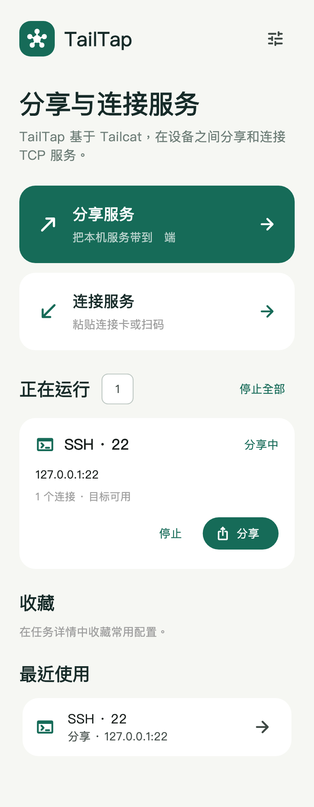 | 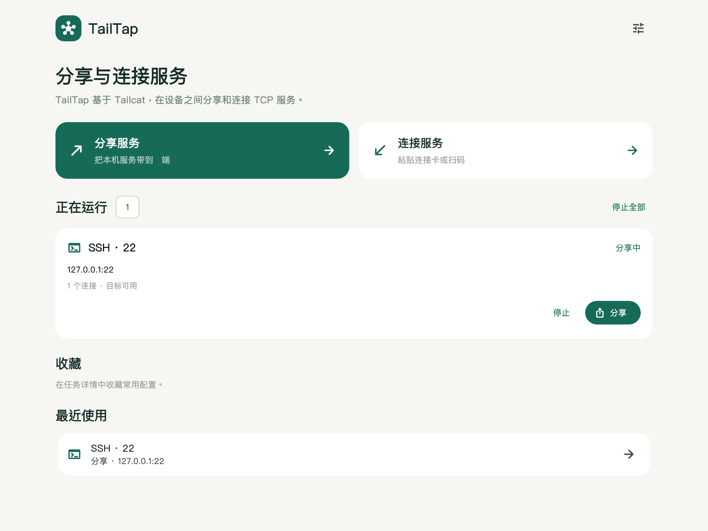 |
| 分享任务详情 | 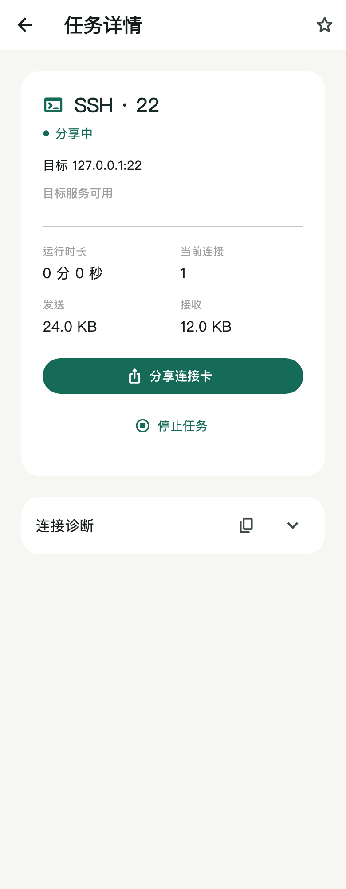 | 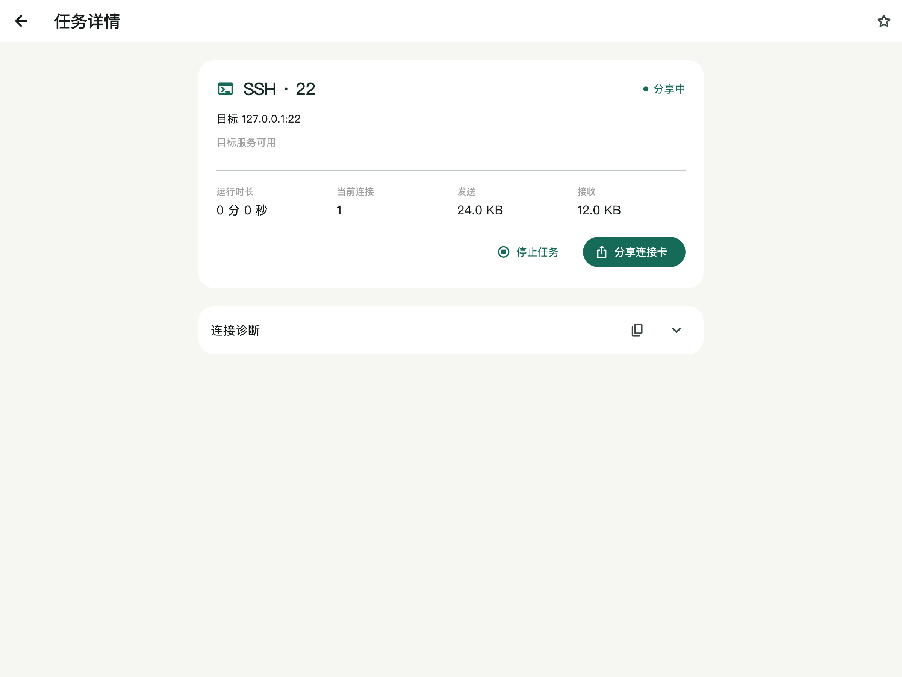 |
| 连接任务详情 | 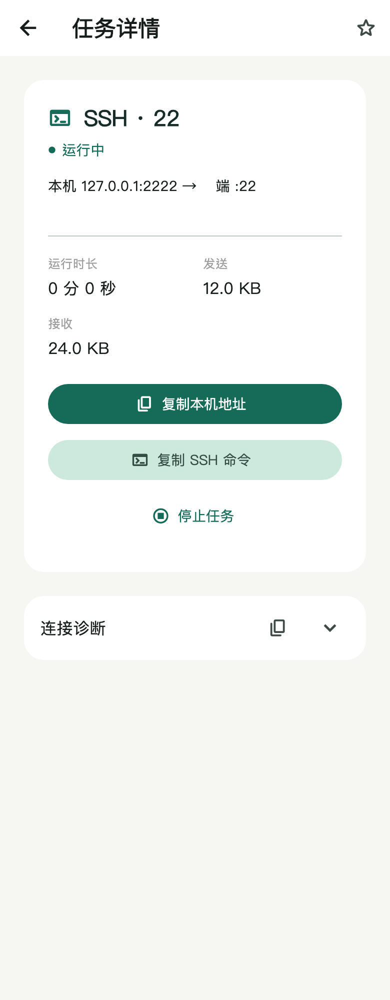 | 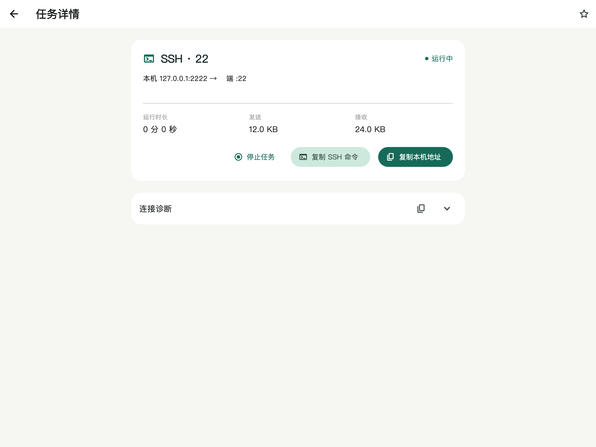 |
| 分享服务 | 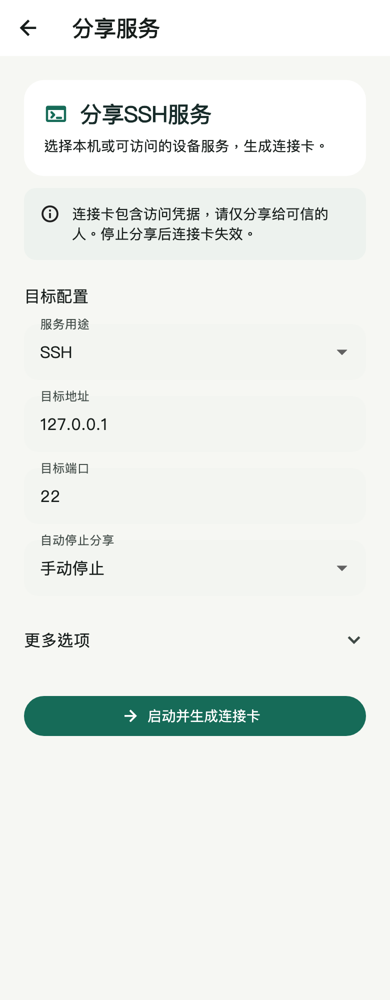 | 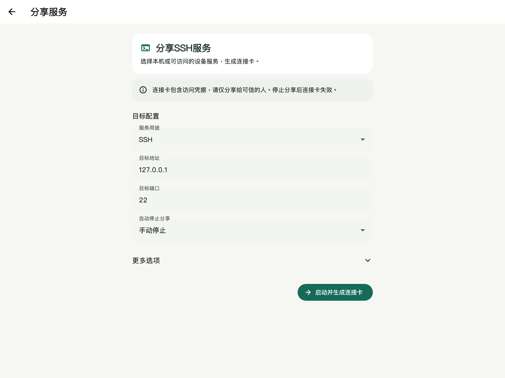 |
| 连接服务 | 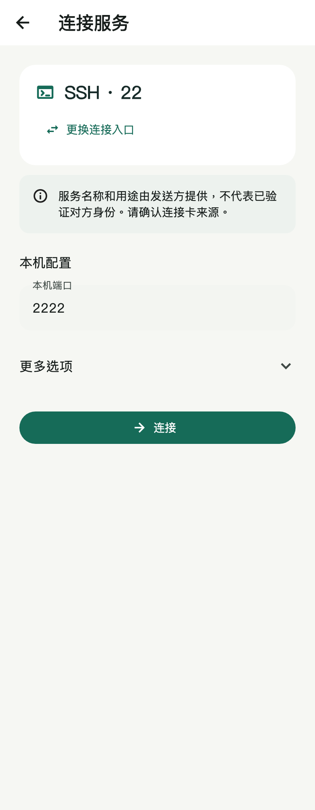 | 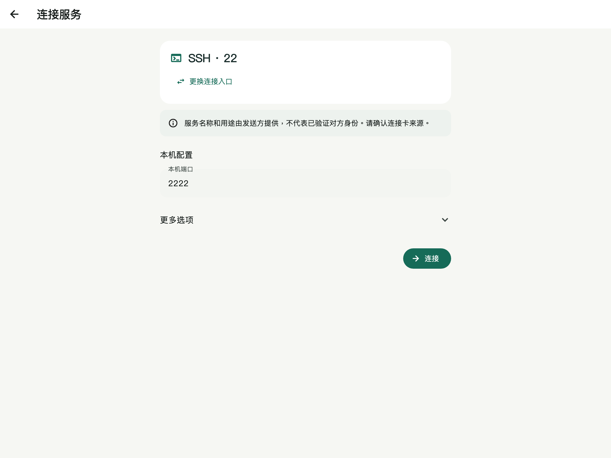 |
| 分享连接卡 | 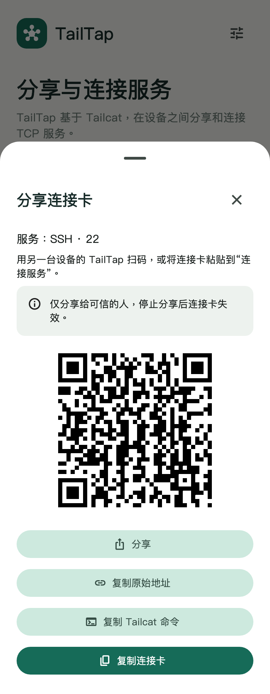 | 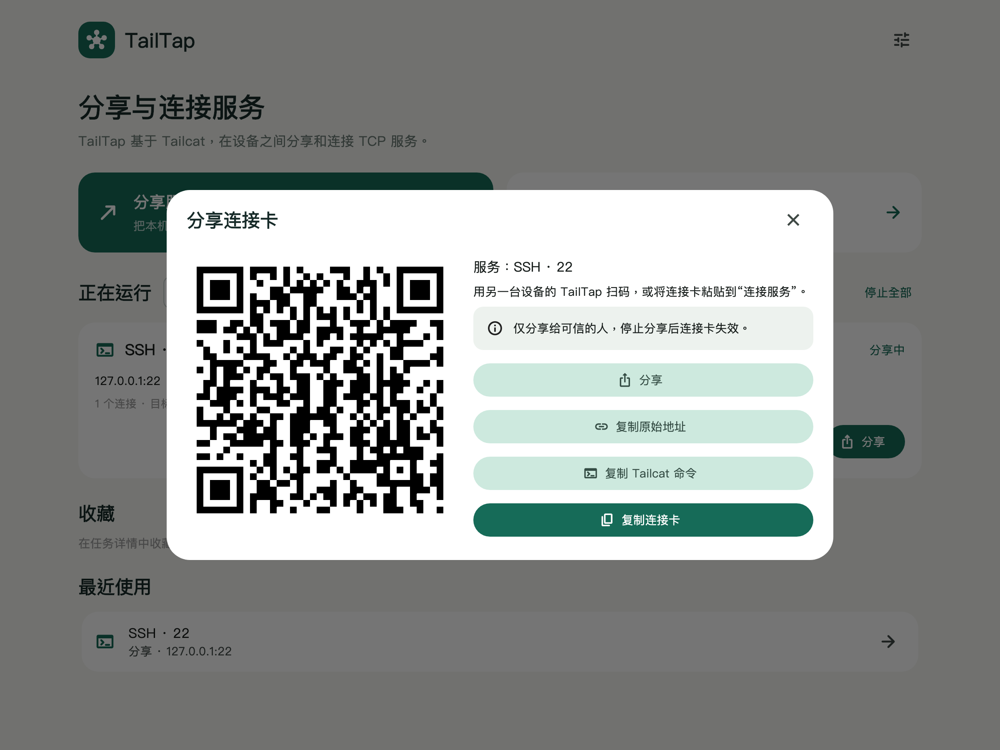 |

## 构建

先安装 Flutter 与 Go，再在仓库根目录执行：

```sh
flutter pub get
./scripts/build-android-core.sh arm64-v8a
flutter build apk --release --target-platform android-arm64 --split-per-abi
```

macOS 构建使用：

```sh
./scripts/build-desktop.sh --release
```

本机连接测试脚本位于 `scripts/`，使用 `uv run scripts/test_device.py <adb-device-id>` 可运行 Android 隧道集成测试。跨设备测试需要连接的 Android 设备和已配置的 Termux SSH 主机。

README 截图由应用组件直接渲染。传入支持中文的字体文件可重新生成：

```sh
TAILTAP_SCREENSHOT_FONT=/path/to/chinese-font.ttf flutter test test/screenshots_test.dart
```

## 开源组件

TailTap 自有代码采用 MIT 许可证，文本见 [LICENSE](LICENSE)。该许可证不替代第三方组件各自的许可证。

隧道核心依赖 [tailcat v0.7.0](https://github.com/tailscale/tailcat/tree/v0.7.0)，它由 Tailscale Inc. 与贡献者开发，采用 BSD 3-Clause 许可证。Go 构建依赖的许可文本与归属信息见 [第三方开源声明](THIRD_PARTY_NOTICES.md) 和 [third_party_licenses](third_party_licenses/)；Flutter/Dart 依赖的许可文本可在应用内“关于与开源许可”页面查看。依赖版本以 `core/go.mod` 与 `pubspec.lock` 为准。

TailTap 是独立项目，不代表 Tailscale。
