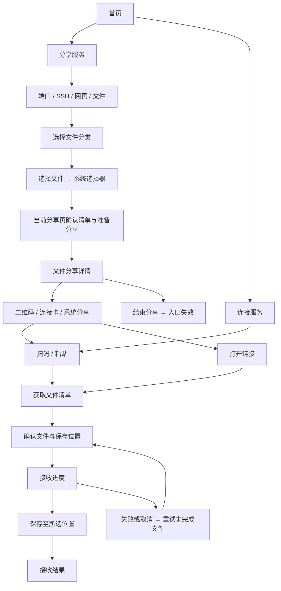

# TailTap 文件分享 PRD 与交互设计

日期：2026-10-04。状态：首版传输闭环已接入，完整产品目标与后续增强仍按本文记录。

当前版本已覆盖：分享页第四项“文件”、系统多选、应用私有只读快照、临时连接卡、Tailcat 隧道内 SFTP 清单读取与流式下载、用户选择保存位置，以及 Android SAF 保存。连接卡停止后失效；分享停止时清理快照。

当前版本尚未覆盖：每文件取消与自动重试、断点续传、校验和、发送方接收会话明细、独立完成结果页、接收记录及系统链接直达。任务详情的“停止任务”可终止当前接收；失败文件可重新选择后从头下载。保存位置写入失败时，当前版本提示对应文件失败；更换位置后需重新接收该文件。停止或失败时清理应用临时副本。下文未标为“当前版本”的交互仍是后续目标，不代表已经交付。

## 1. 产品目标

发送方选文件并生成分享入口，接收方扫码或粘贴，确认文件和保存位置后接收。用户完成传输不需要搭建 SSH 服务、填写端口或操作文件管理器。

底层采用发送方提供只读文件、接收方下载的方式。产品使用“分享文件”“接收文件”，不要求用户理解服务端与客户端。

| 首版包含 | 首版不包含 |
|---|---|
| 单个或多个普通文件 | 文件夹共享、递归目录浏览 |
| 文件清单、大小、逐文件下载进度 | 远程重命名、删除、上传与读写管理 |
| 二维码、连接卡、系统分享 | 设备发现、推送邀请、聊天式投递 |
| 系统文件选择器与保存位置选择 | 长期收件箱、固定文件入口 |
| 停止当前接收、失败提示、已完成文件标记 | 逐文件取消、自动重试、独立结果页、暂停、跨进程断点续传、自动压缩 |
| 临时连接卡、链路诊断 | 长期设备身份、设备授权、云端存储、云中转文件、副本同步 |

首轮支持 macOS 与 Android。服务端只提供选中的文件，不分享原文件所在目录。系统目录选择器仅用于接收方指定保存位置，不代表提供文件夹共享功能。

## 2. 入口与页面结构

首页保留“分享服务”和“连接服务”两个主入口。进入分享页后，用同一组水平分类选择“端口／SSH／网页／文件”。“文件”是第四项，与其他分类使用相同的图标、字号和选中样式。

分类控件位于页面概览与统一 Notice 之后、具体配置之前，切换时保持原位置。选择“文件”后，在当前分享页展示选文件、文件清单、可选名称、自动停止时间和主操作。选择分类只切换内容，点击“选择文件”才打开系统选择器。

“连接服务”继续承接粘贴与扫码，输入框说明为“粘贴服务或文件连接卡”。识别文件连接卡后，在连接页选中“文件”，展示文件清单和保存位置。连接页同样使用“端口／SSH／网页／文件”水平分类，但分类必须与连接卡类型匹配：文件卡不能作为端口服务连接，服务卡不能用于接收文件。不匹配时保留输入并提示更换连接卡，不启动任务。

系统打开文件链接进入同一连接页，读取清单后等待用户确认，不自动下载。更换连接入口沿用现有粘贴与扫码操作。发送与接收共用页面框架：概览、正文 Notice、水平分类、配置或清单、右侧主操作。

首页“正在运行”共用任务列表，以服务任务、文件分享、文件接收的图标和副标题区分。文件传输结果进入现有“最近使用”，展示方向、数量、时间和结果。点击已完成记录查看结果，不直接重新启动传输。文件任务不加入收藏，文件名与本机路径不展示在首页摘要中。

## 3. 发送方流程

### 3.1 选择与确认

进入分享页并选择“文件”后，概览标题显示“分享文件”，说明为“选择文件，生成连接卡供另一台设备接收”。空状态显示带文件图标的“选择文件”按钮，主操作在未选文件时不可用，并显示原因。

点击“选择文件”调用系统多选文件选择器。取消选择返回当前分享页，保留已有选择，不创建任务。macOS 支持在文件分类下拖入文件作为辅助操作，拖入文件夹时说明“暂不支持文件夹，请先压缩成文件”，不递归展开。

选完留在当前分享页，正文依次显示文件数量与总大小、文件清单、可选名称、自动停止分享、操作区。清单只显示名称、大小和移除按钮，不展示源路径、目录树或文件预览。“添加文件”再次打开系统选择器。地址、端口、SSH 用户名和网页配置只出现在对应分类中。

任务启动前切换分类时，保留本次页面会话的文件选择与各服务表单输入。分类切换不读取文件正文、不创建临时副本、不启动服务。离开页面后再次进入，不自动恢复文件访问或复用上次文件清单。

文件分享沿用临时连接卡访问方式。任何持有有效连接卡的人都可以尝试接收，因此连接卡应通过可信渠道发送。文件分享不提供固定入口、长期身份或设备授权列表。

默认分享时限为手动结束，提供 15、30、60 分钟。选择时限时提示“时间到后结束分享，未完成的接收会中断”。正文 Notice：“请仅分享给可信的人。结束分享后，连接卡失效。”

主操作为“准备并分享”。读取权限丢失、文件不可读或剩余空间不足时指出具体文件，保留清单。文件大小无法确定时显示“大小待确认”，准备完成前不展示不准确的总大小。空文件可分享。

### 3.2 准备分享

首版将选中文件复制到应用私有的临时分享空间，形成只读快照。这样 Android 文档 URI 可统一接入核心，原文件随后修改也不会改变本次分享内容。仅快照中的文件对外可见。

准备页显示“正在准备 2/5 个文件”、已读取数据量、当前文件和取消操作。准备成功后再启动文件服务、生成入口、打开连接卡面板。准备失败不发布半套入口，提供移除失败文件或重试。取消后关闭任务并清理未使用的临时副本。

重复选择同一来源文件去重。不同来源的同名文件在准备阶段生成不冲突的展示名称，例如“报告 (2).pdf”，接收方与保存结果采用同一名称。支持空文件、Unicode 名称和无扩展名文件。

首版不预设固定文件大小上限，是否可准备取决于可读取性和可用临时空间。准备前检查空间，复制中持续处理空间不足，UI 明确说明“分享时会创建临时副本”。不假定云端文件已下载或一定可读取。

### 3.3 分享详情

顶部状态卡显示“分享 5 个文件”、总大小、等待接收或正在被下载、入口有效时间。卡内次级正文说明“请保持此设备在线”。操作区左侧“结束分享”，最右主操作“分享连接卡”。

下方显示静态文件清单与接收活动，连接诊断沿用现有任务详情，始终展开。传输按临时接收会话展示进度，不展示或推断接收设备的持久身份。

文件连接卡面板沿用现有宽窄布局：标题“分享文件”，二维码与文件数量摘要，统一 Notice，系统分享和高亮的“复制连接卡”。首版不展示端口转发命令，原始地址复制放在次级操作中。

发送方不能仅凭读取字节数宣称“对方已保存”。首版显示“已提供 35 MB”或“本次读取结束，接收方保存结果未知”。接收成功由接收方页面确认。没有已实现的应用层回执时不提供“对方已收到”的承诺。

## 4. 接收方流程

### 4.1 预览与确认

识别连接卡后显示“正在获取文件信息”，建立隧道并读取实际清单。此时只读取受限的元数据，不下载文件正文。连接卡内的名称和大小只能作为提示，预览以实际服务清单为准。

连接页选中“文件”时，概览显示文件数量与总大小，正文 Notice：“请确认分享来源。接收后，请自行判断文件是否安全。”水平分类下方显示静态清单，每项名称、大小和选择框，默认全选，支持全选与取消全选。文件接收不展示本机监听端口、远端端口或其他服务专用字段。

清单不是文件浏览器，没有路径导航、进入目录、排序编辑或远程操作。清单内只接受普通文件。来自旧版本或原始 SFTP 地址时不自动递归浏览，提示使用文件连接卡或外部 SFTP 工具。

保存位置为独立表单项，显示实际目录与“更换”。macOS 首次建议系统下载目录，开始前验证写入权限。Android 首次使用系统目录选择器授权，后续复用有效授权。取消目录选择保留预览，不启动下载。无保存位置或未选文件时主操作不可用并显示原因。

主操作“接收 5 个文件”。接收方只需确认这一次操作，不需要填写本机端口。连接失败时展示可观察到的错误原因，不声称“对方拒绝”。

### 4.2 传输与保存

首版按清单顺序接收文件，降低并发与错误恢复复杂度。显示总体进度、已接收／总大小、平滑后的当前速度、当前文件和每项状态。不强制显示剩余时间，速度未知时用占位说明。

文件先写入应用私有临时区，完成后核对长度，再保存到选定目录。显示状态依次为“接收中”“保存中”“已保存”。应用内校验不能只依赖扩展名，不自动打开或执行文件。

校验失败、空间不足或目标权限丢失时，该文件失败并说明原因。下载完成但保存失败时保留临时副本，提供“更换位置并保存”，避免重新传输。成功文件不因其他文件失败被删除。

默认不覆盖同名文件，生成可用新名称。创建目标文件必须处理竞态，不能先检查名称再覆盖。Android 文档提供方可能调整名称，结果页面显示实际文件名与保存位置。目标保存中取消或崩溃可能留下不完整文件，使用临时名称并尽力清理，下次启动明确列出未完成项。

取消只终止本次接收，不结束发送方分享。显示“已保存 2 个，3 个未完成”，保留已完成文件。未完成的下载重试从该文件开头开始，清单中已保存项默认不再选择。

### 4.3 结果

成功页显示“已保存 5 个文件”、总大小与保存位置。主操作“查看保存位置”，次操作“完成”。平台不能打开目录时改为“查看文件”，单文件可交给系统打开，Android 使用安全内容 URI 授权。

部分完成页列出成功与失败文件，主操作“重试未完成文件”，次操作“更换保存位置”或“完成”，按具体失败原因显示。重试前重新验证分享仍有效、清单版本一致和权限可用。旧入口失效时保留成功记录，提示向发送方索取新连接卡。

## 5. 状态与生命周期

| 对象 | 主要状态 |
|---|---|
| 文件分享 | 选文件 → 准备中 → 等待接收／提供文件中 → 结束中 → 已结束 |
| 文件接收 | 获取清单 → 待确认 → 接收中 → 保存中 → 全部完成／部分完成／已取消 |
| 单个文件 | 待接收 → 接收中 → 待保存 → 保存中 → 已保存／失败 |

分享启动后文件集合冻结。追加或移除文件需要结束并重新创建分享，新入口与新清单对应。首版没有“接收一次即失效”模式，支持多个接收方，在发送方主动结束或到时后统一关闭入口。

结束分享正在传输时确认：“结束后，未完成的接收会中断。”自动到时使用同一结果但不额外弹确认。结束必须先关闭文件服务和连接，再销毁临时连接凭据，最后清理快照。再次分享生成新入口。

关闭页面不取消任务。macOS 菜单栏与 Android 前台通知汇总活动文件和服务任务，点击返回相应详情。显式退出、系统终止或设备离线可能中断传输，不承诺永久后台运行。

应用启动后将上次未结束的分享标记为已中断，不复用临时入口。接收记录保留已保存项，未完成下载不自动恢复。保存失败的完整临时文件保留 24 小时供用户重试，并显示清理时间。分享快照结束即清理，清理失败登记后续清理，不影响已保存目标文件。

“最近使用”中的文件记录只保存方向、时间、数量、总大小、结果和必要的本机文件引用，不保存可复用分享凭据。记录沿用现有列表的保留与清空规则，清空不删除用户已保存文件。文件名属于本机可见的私人信息，只在结果详情展示，不进入诊断导出。

## 6. 响应式交互

| 页面区域 | 宽布局 | 窄布局 |
|---|---|---|
| 水平分类 | 四项等宽平铺，位于配置上方 | 保持四项平铺，不变为下拉菜单，图标和文字可按宽度调整间距 |
| 选择确认 | 单列受限宽度，清单与配置依次排列 | 同一结构，文件名最多两行并可查看完整名称 |
| 连接卡 | 左二维码、右摘要与操作，尺寸固定上限 | 二维码居中、操作竖排，内容可滚动 |
| 接收确认 | 清单在上，保存位置和操作在下 | 同一顺序，接收按钮全宽 |
| 传输详情 | 顶部总体状态，下方文件逐项状态 | 同一层级，取消靠左，主操作靠右或最后一行 |

以可用宽度切换布局，沿用现有约 640 逻辑像素起点。清单区可滚动，页尾操作保留安全间距，短窗口不得裁切。四种视觉层级为页面标题、总体结果、文件条目、辅助说明，不给每个字段套一张大卡片。

操作按钮统一带图标。高强调仅给当前主要动作，取消和结束为低强调。Notice 与现有连接服务一致，放在确认来源、分享访问范围等相关正文内，不使用页尾脚注承载风险信息。

## 7. 协议与核心约束

当前版本沿用 `tailtap://connect` 连接卡格式，以 `kind=file` 区分文件分享，远端 SFTP 端口固定为 `2222`。连接卡包含临时 Tailcat 地址和显示名称，不携带本机绝对路径或任意执行指令。Tailcat 地址本身是临时访问凭据；获得该地址的人可以读取本次快照中的文件，因此应通过可信渠道分享。

当前版本由只读 SFTP 返回根目录普通文件清单，接收方按文件名请求下载；发送方临时快照仅含用户选中的普通文件，接收端拒绝路径分隔符和非普通文件。当前没有独立应用清单、稳定文件 ID、清单版本或内容哈希；下载时核对文件长度。

分享与接收使用 Tailcat 隧道内的只读 SFTP。Tailcat 的文件服务负责限制到快照目录并禁用写操作，TailTap 仍需确保快照目录只含选中文件。当前不向 SFTP 根目录写入应用元数据，因此没有额外名称空间。

接收端使用应用内 SFTP 客户端，不依赖 Android 系统存在 `scp`。当前进度按文件字节更新，完成时核对文件长度；尚无内容哈希或应用层接收回执。原始 CLI 可通过 `tailcat ls` 和 `tailcat cp` 读取可见文件，但应用连接卡的接收界面仍需 TailTap。

当前版本以加密传输、不可变快照和文件长度校验为基础，不宣称支持端到端内容哈希校验。后续如增加 SHA-256，应在准备阶段生成并在接收完成后核对，失败不得标记已保存。

接收完成包含“下载到临时区”和“保存到所选目录”两个阶段，需要考虑临时副本和目标副本同时占用空间。不可用空间测量或文档提供方限制时不给肯定成功承诺，写入失败按文件展示。

日志与诊断排除源路径、文件名、保存位置、连接卡、原始地址和访问凭据。只记录传输阶段、字节量、路径类型、错误类别与脱敏事件。文件任务复用链路诊断，但延迟与路径不能替代文件完成状态。

## 8. 异常与恢复

| 情况 | 页面行为 |
|---|---|
| 系统选择器取消 | 返回原页面，不生成任务 |
| 云文件下载失败或权限过期 | 指出文件，提供重新选择，其他选择保留 |
| 发送端空间不足 | 准备失败，尚未生成连接卡，提供减少文件 |
| 分享方离线或入口失效 | 保留预览与已保存项，提供重试或更换连接卡 |
| 网络切换 | 显示恢复中，超时后失败，手动从当前文件开头重试 |
| 文件大小或清单版本变化 | 停止该文件，重新确认清单，不拼接旧数据 |
| 下载失败但已有完成项 | 显示部分完成，重试仅选择未完成项 |
| 接收端空间不足 | 保留完成项，提供释放空间后重试 |
| 保存权限失效 | 完整临时文件保留，提供更换位置并保存 |
| 文件名不合法 | 本机规范化命名，显示最终名称，不允许逃出保存位置 |
| 服务关闭、应用退出、到期 | 中断活动传输，入口失效，已保存文件不受影响 |

## 9. 验收场景

1. Mac → Android 与 Android → Mac 单文件、多文件传输成功，接收前不下载正文。
2. 接收方只看到选中文件，原目录的其他文件、父目录、符号链接目标和 shell 均不可访问。
3. 同名文件、空文件、Unicode 名称、大文件和云文档来源处理正确，保存结果名称准确。
4. 准备时原文件改变不影响已完成快照，准备中读取变化或权限失败明确失败，不发布部分清单。
5. 只有持有有效临时连接卡的接收方可以尝试连接；发送方结束或分享时限到期后，旧卡不能再建立连接。
6. 同一入口多个接收方同时使用可区分会话，发送方不凭读取结束显示“对方已保存”。
7. 下载成功但保存失败不显示成功，更换位置可从完整临时副本保存。
8. 取消、断网与发送方结束时保留已保存文件，重试未完成文件不会重复下载已完成项或覆盖同名文件。
9. 应用退出后临时入口失效，未完成记录显示中断，临时副本按规则清理。
10. 窄布局、宽布局和短窗口下，清单、按钮、二维码和长名称可用，文案不裁切。
11. 非法版本、超大清单、路径穿越及恶意文件名被拒绝，日志和诊断不泄漏凭据或文件路径。
12. 平台目录授权失效、目标存储空间不足、清理失败及保存中进程结束都有明确结果。
13. 从首页“分享服务”进入后可直接选择第四项“文件”，选择分类不自动弹出选择器，取消选文件仍停留在当前表单。
14. 任务启动前切换分类能保留当前会话输入与文件选择，只有点击主操作才准备快照并启动分享。
15. 连接页识别文件卡后选中“文件”，服务卡与文件卡不匹配时提示更换入口，不误启动其他类型任务。

## 10. 实施与评审重点

先验证 Android 系统文件 URI 的快照读取、SFTP 服务隔离和接收目录保存，再设计清单协议与传输事件，最后接入页面和后台通知。平台验证通过前不把 Go 路径支持等同于 Android 文档访问支持。

文件能力接入分享和连接页的第四项水平分类，沿用两页现有框架、统一 Notice 和任务详情。首版采用一次多文件、临时连接卡、临时快照、手动结束、多个接收方和逐文件重试。首版不承诺自动一次性销毁或对方已保存回执。评审后再进入具体技术设计。

## 参考

- [Tailcat v0.7.0 文件传输](https://github.com/tailscale/tailcat/blob/v0.7.0/README.md#send-and-receive-files)：SFTP、文件服务与 CLI 行为。
- [Tailcat 文件服务类型](https://github.com/tailscale/tailcat/blob/v0.7.0/tailcat_files.go)：只读模式、目录边界与 shell 配置。
- [临时连接与链路诊断](identity-access-diagnostics-prd.md)：当前连接卡生命周期和链路诊断约束。
