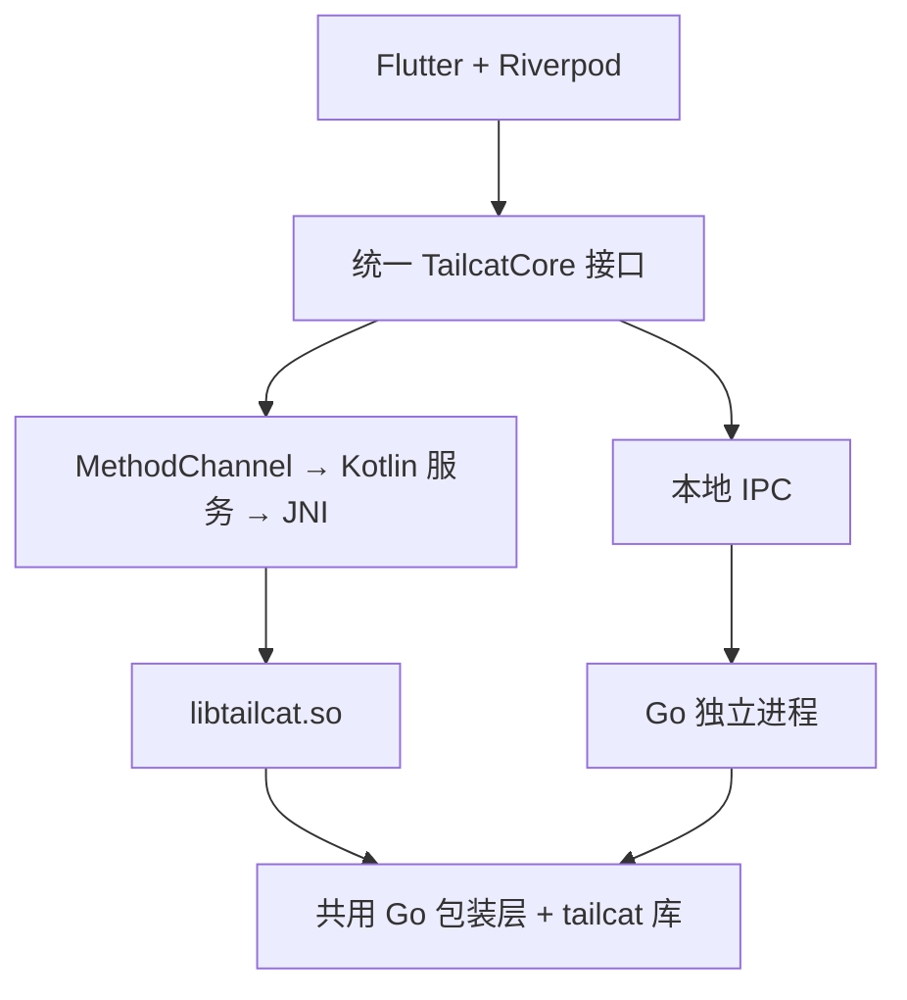
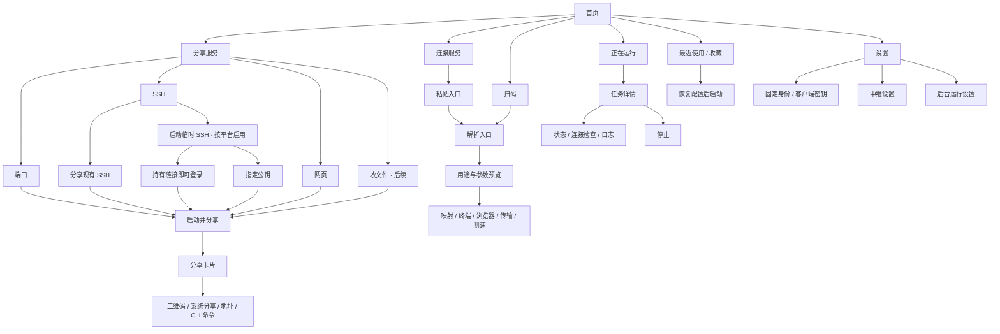
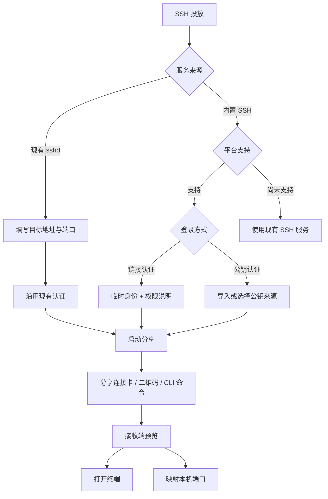
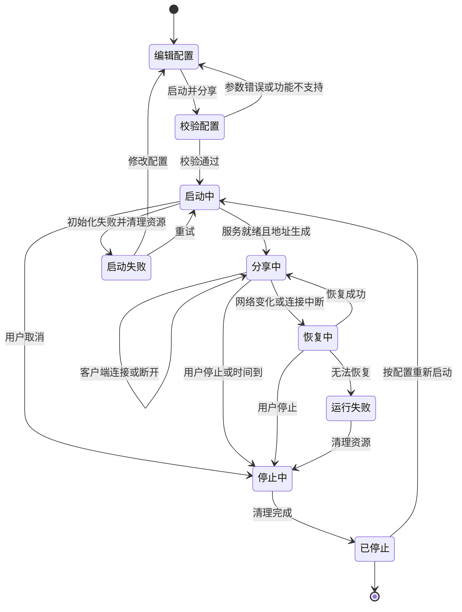
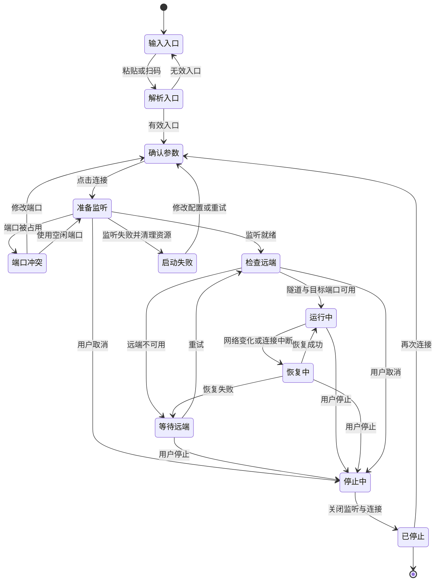
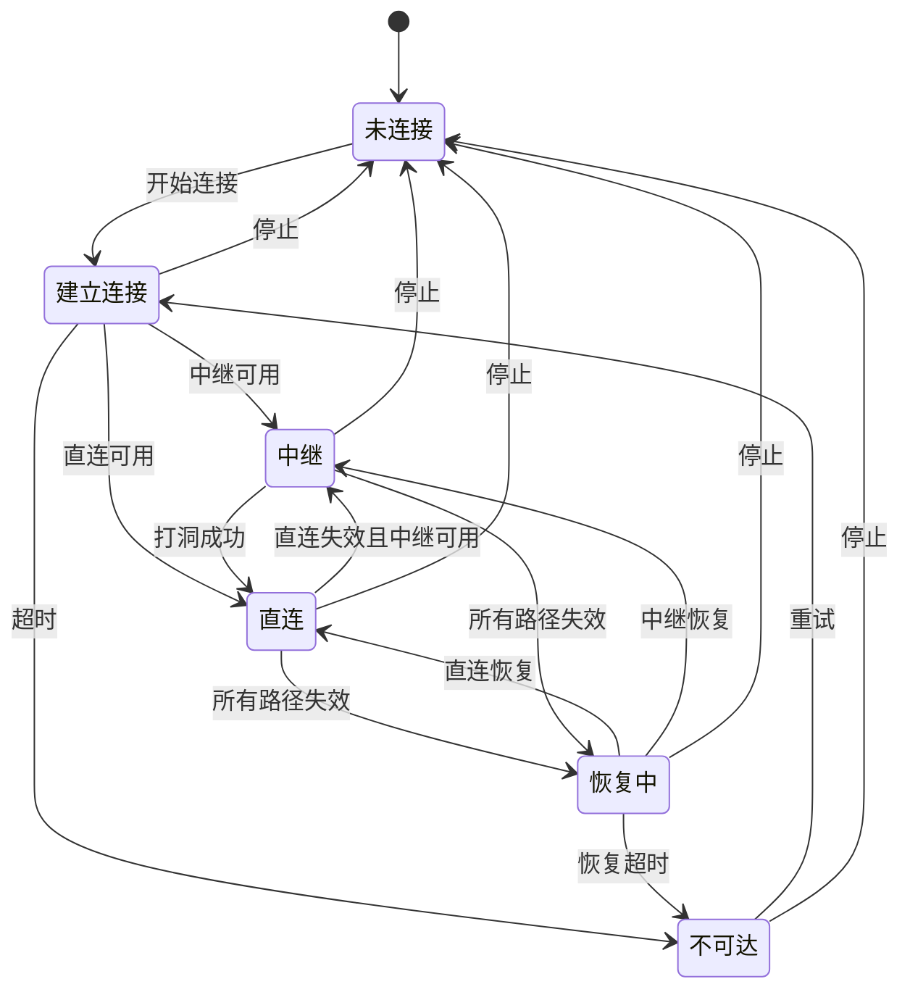
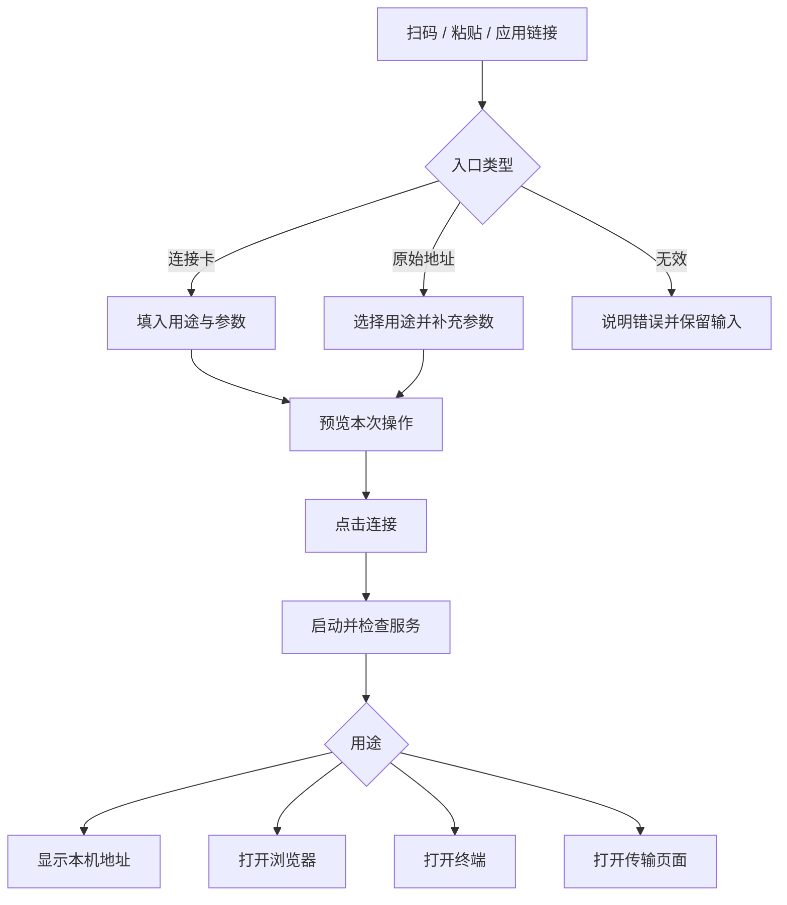

# TailTap 产品与交互设计

设计日期：2026-10-03。本文描述产品方案，供界面与核心实现参考，不表示功能已经实现。

## 产品目标

选择一个服务，生成分享入口。收到入口后，在本机直接使用。

主要需求是快速端口映射，以及 SSH 投放、网页直达等快捷操作。Android 是主要目标平台，同时保留桌面支持。功能优先级来自当前需求推导，官方没有公开使用频率数据。

## 技术方向

采用 Flutter + Go，参考 FlClash 的跨平台核心结构。

- Flutter 负责界面，Riverpod 管理状态。
- Go 包装层调用 tailcat 库，统一任务、命令和事件。
- Android 使用 CGO 共享库、JNI 和 Kotlin，Flutter 通过 MethodChannel 控制核心。前台服务管理后台连接。
- 桌面使用独立 Go 进程，通过本地 IPC 通信。
- 首版端口转发使用普通前台服务。全局流量接入 VPN 是后续独立范围。

Termux 已能编译并启动 tailcat CLI。这验证了命令行构建与启动，APK 共享库、实际联网和后台生命周期仍需分别验证。Android APK 的 shell 属于应用环境，不等于 Termux shell。

## 功能范围

| 阶段 | 功能 | 主要操作 |
|---|---|---|
| 首版 | 分享端口 | 输入端口 → 启动 → 分享 |
| 首版 | 连接端口 | 扫码或粘贴 → 确认参数 → 连接 |
| 首版 | SSH 投放 | 分享现有 SSH，或在支持的平台启动临时 SSH |
| 首版 | SSH 客户端 | 打开终端，或映射给其他客户端 |
| 首版 | 网页直达 | 建立映射后打开浏览器 |
| 首版 | 最近使用与收藏 | 恢复配置并重新启动 |
| 首版 | 运行状态 | 显示监听、目标可用性、直连或中继及错误 |
| 后续 | 文件投递 | 选择目录 → 分享 → 接收文件 |
| 后续 | 测速 | 检查路径 → 选择方向与时长 → 测速 |
| 后续 | SOCKS 与远端局域网 | 高级连接功能 |

首版通用端口映射按 TCP 设计，不将 TCP 转发描述成支持 iperf3 UDP 测速。开发分支的内置 perf 能力按固定的核心版本单独启用。

## 页面入口

首页上方放置 **分享服务**、**连接服务** 和 **扫码**。主体显示正在运行的任务，其次显示收藏和最近使用。密钥、中继和日志进入设置或详情。

## 首页任务卡片

分享卡片显示名称、目标地址与端口、分享状态和已连接数量，提供 **分享** 与 **停止**。

连接卡片显示名称、本机端口到远端端口的关系、路径与延迟，提供 **复制地址**、用途对应动作及 **停止**。路径尚未检测时显示未知，不显示为直连。

详情显示持续时间、上下行数据量、映射清单、最近错误和日志。停止单个任务只清理该任务的资源，其他任务继续运行。

## 分享端口

默认只要求填写目标端口，目标地址为 `127.0.0.1`。名称可选。局域网目标需要填写明确的 IP 或主机名。

| 字段 | 默认值与行为 |
|---|---|
| 类型 | 端口，可切换 SSH、网页、收文件 |
| 目标地址 | `127.0.0.1` |
| 目标端口 | 必填，校验有效端口范围 |
| 名称 | 可选，根据用途与端口生成 |
| 隧道端口 | 默认等于目标端口，放入更多选项 |
| 身份 | 临时身份 |
| 自动停止 | 默认手动停止，可配置时长 |

更多选项包含多个映射、固定身份、允许的客户端与自动停止。核心版本不支持的映射形式不生成对应 CLI 命令。

点击 **启动并分享** 后，等待服务就绪与地址生成再打开分享卡片。目标服务暂时不可用时明确标注，不把隧道启动成功等同于目标可访问。

分享卡片提供二维码、系统分享、原始 tailcat 地址和客户端命令。默认不自动发送给联系人。

## 连接端口

应用连接卡自动填入用途与端口。原始 tailcat 地址只提供连接身份，需补充用途与远端端口。扫码、粘贴与打开应用链接共用解析流程，预览后由用户点击 **连接**。

通用映射优先尝试同号本机端口。端口被占用时显示 **修改端口** 和 **使用空闲端口**，不静默更改用户指定端口。网页模式默认使用空闲端口，建立后打开本机浏览器。

本机监听默认绑定 `127.0.0.1`。需要其他设备访问时，在高级选项中选择允许局域网访问，并显示实际监听地址。

示例：远端 iperf3 服务为 5201，本机映射为 15201。任务卡片显示 `127.0.0.1:15201 → 远端 :5201`，提供复制地址与测速命令。

目标检查避免对未知协议发送应用数据，只作必要的连接检查。检查通过不等于 SSH 认证或具体应用会话成功。

## SSH 投放

| 模式 | 行为 | 平台范围 |
|---|---|---|
| 分享现有 SSH | 转发已有 sshd，保留原账户与认证 | Android 和桌面，要求目标 sshd 已运行 |
| 临时 SSH | tailcat 内置服务，选择链接认证或公钥认证 | 先在支持的平台提供，Android 单独验证 |

现有 SSH 默认提供 22 和 Termux 8022 端口快捷项。Android 上优先采用现有 Termux sshd 映射，不把 APK 内置 shell 当作 Termux 环境。

**持有链接即可登录** 对应 `no-auth-ssh`。选项旁明确说明：获得链接的人可以操作当前账户。默认使用临时身份，停止后该入口失效。

**指定公钥** 支持导入公钥或选择受支持的公钥来源。获取失败或格式无效时说明原因，不降级为免认证。

接收端支持 **打开终端** 和 **仅映射端口**。SSH 会话结束不自动停止其他映射。原生 CLI 的 SSH 与 cp 调用系统程序，GUI 的终端与文件传输需要应用内客户端实现。

## 连接卡与身份

连接卡是 TailTap 新增的协议，不是 tailcat 原始地址的扩展保证。建议包含格式版本、tailcat 地址、显示名称、用途、隧道端口、网页协议与路径等元数据。具体 URI 格式在实现协议时确定。

名称和用途来自发送端，只作为提示，不证明服务身份。不包含服务器私钥、客户端私钥或执行任意命令的指令。接收未知格式版本时说明不兼容，保留复制原始地址的能力。

二维码与链接中的地址可能包含访问凭据，不写入常规日志。复制和系统分享由用户主动触发。

最近使用保存配置。收藏保存配置及选定身份。临时分享停止后，旧入口不再有效。重新启动临时分享生成新地址，不自动更新已发出的连接卡。固定身份属于显式高级选项，重复分享的访问范围需要在界面说明。

## 分享任务状态机

分享任务允许多个客户端连接。单个客户端退出不停止分享。

## 连接任务状态机

本机监听、隧道可达与目标端口可用分别记录。等待远端时保留本机监听，并明确显示远端不可用。

## 隧道路径状态机

路径状态与任务生命周期独立。直连退回中继时，任务仍保持运行。恢复成功只更新路径，服务可用性另行检查。

## 接收入口流程

## 后台与异常交互

Android 前台服务承载活动任务，常驻通知显示任务数量，提供 **返回应用** 和 **停止全部**。关闭界面不等于停止任务。平台可能终止进程，不能将前台服务描述成永久保活。

| 情况 | 界面行为 |
|---|---|
| 本机端口冲突 | 指出端口并提供修改或空闲端口选择 |
| 隧道可达但目标未运行 | 显示远端服务不可用，提供重试 |
| SSH 认证失败 | 保留映射，提示检查凭据 |
| Wi-Fi 与移动网络切换 | 显示恢复中，成功后更新路径 |
| 进程被系统终止 | 下次打开显示任务已中断，不恢复成运行中 |
| 临时身份丢失 | 重新启动生成新入口，提示重新分享 |
| 旧连接卡无法访问 | 保留参数，提供重试和更换入口 |
| 公钥来源获取失败 | 显示具体错误，不切换为链接认证 |

停止与启动需要串行协调。停止完成后释放端口、连接和任务订阅。迟到的启动结果不能重新激活已停止任务。多个映射可以共用底层资源，但任务之间的停止行为必须隔离。

## 后续快捷功能

文件投递沿用分享流程，选择目录后显示入口、进度和完成记录。Android 文档目录访问需适配系统文件选择与 URI 权限，不能假定所有目录都能作为 Go 文件路径直接使用。

测速使用固定核心版本提供的能力。当前开发分支的 perf 支持方向、时长及 TCP/UDP 等选项，公共 DERP 压测被拒绝。界面保留该限制，直连失败时显示路径原因，不自动改为公共中继测速。

## 实现验证重点

- APK 加载共享库，启动真实端口映射。
- Android 后台运行与网络切换后恢复连接。
- 多任务并行、取消启动、重复停止与端口释放。
- 临时分享停止后重新启动，生成新入口。
- 原生 CLI 与 GUI 双向连接及分享卡版本兼容。
- SSH 终端、现有 Termux sshd 映射与认证错误处理。

## 参考来源

调研时间为 2026-10-03。开发分支能力需在实现时固定到具体提交，不能用 main 文档替代发行版本能力判断。

- [tailcat v0.7.0 README](https://github.com/tailscale/tailcat/blob/v0.7.0/README.md)：发行版端口、SSH、文件与浏览器功能。
- [tailcat main README](https://github.com/tailscale/tailcat/blob/main/README.md)：开发分支映射、测速、身份与中继行为。
- [FlClash 架构](https://github.com/chen08209/FlClash/blob/main/.agents/architecture.md)：Android 共享库与桌面进程方案。
- [FlClash Go 导出层](https://github.com/chen08209/FlClash/blob/main/core/lib.go)：CGO 接入。
- [FlClash Dart 核心层](https://github.com/chen08209/FlClash/blob/main/lib/core/lib.dart)：平台适配与生命周期。
- [Android 进程生命周期](https://developer.android.com/guide/components/activities/process-lifecycle)：后台进程边界。
